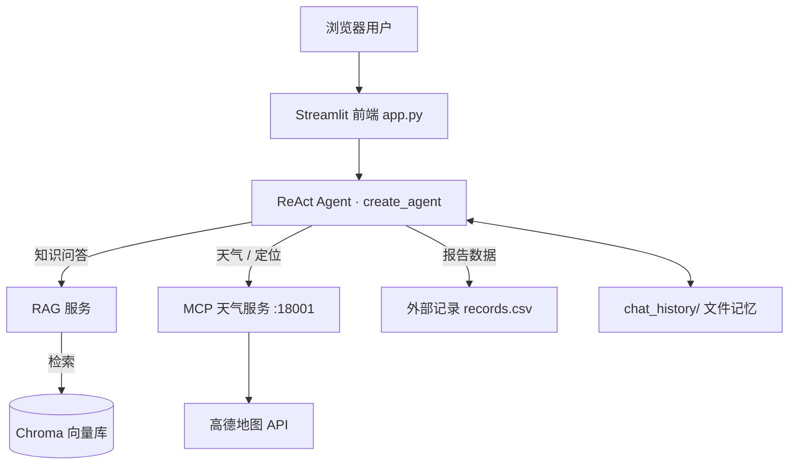
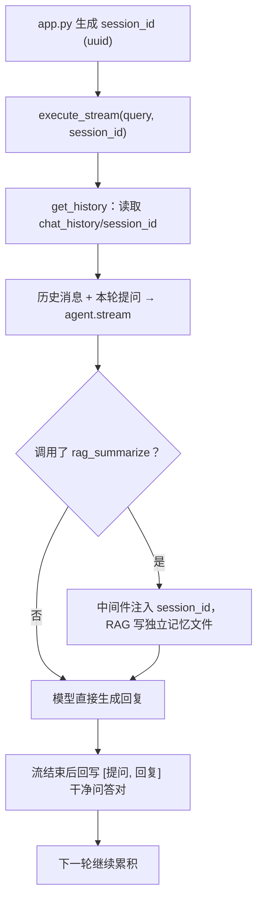
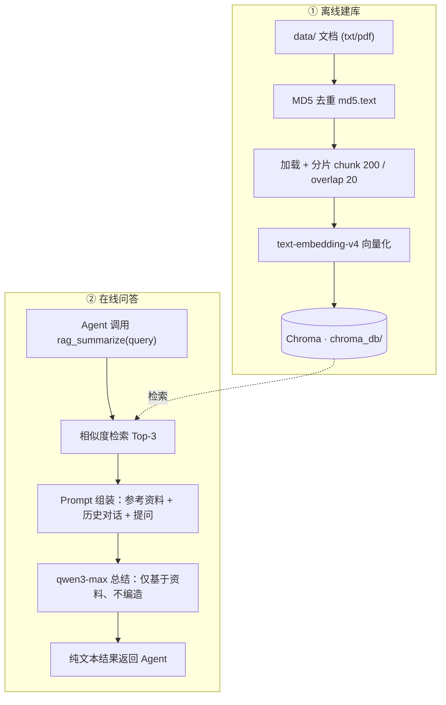

# 智扫通 · 扫地机器人智能客服

   

> 一个「记得住上下文、答得出依据、查得到天气、写得成报告」的扫地机器人客服 Demo。
> Streamlit 负责交互，LangChain 负责大脑，RAG 负责知识，MCP 负责外部能力。

---

## 项目速览

面向扫地机器人 / 扫拖一体机器人用户的对话式客服：用户抛出问题后，Agent 自主决策「直接答」还是「先查资料、查天气、读使用记录」，再以流式方式输出结论。

四个值得一看的设计：

- **记忆** —— 纯 LangChain 实现的多轮会话记忆：`BaseChatMessageHistory` 把对话落盘到文件，不依赖 LangGraph checkpointer；目录删了自动重建，不同会话天然隔离。
- **RAG** —— 一条完整的检索增强链路：MD5 去重 → 中文友好分片 → 向量检索 → 提示词强约束总结，「建库到问答」全程可复现。
- **MCP** —— 天气与定位拆成独立 MCP Server 进程，主程序启动时自动发现工具，新增能力无需改动 Agent 主代码。
- **报告模式** —— 中间件识别「生成报告」意图后动态切换系统提示词，串起「取用户 ID → 取月份 → 读使用记录 → 输出 Markdown 报告」的固定流程。



Agent 工具箱（5 个本地 + 2 个 MCP）：

| 工具 | 提供方 | 用途 |
|------|--------|------|
| `rag_summarize` | 本地 | 知识库检索并总结专业资料 |
| `get_user_id` / `get_current_month` | 本地 | 提供报告所需的用户 ID 与月份（演示数据） |
| `fetch_external_data` | 本地 | 读取指定用户、月份的使用记录 |
| `fill_context_for_report` | 本地 | 触发报告模式，通知中间件切换提示词 |
| `get_weather` / `get_user_location` | MCP 服务 | 城市天气实况、IP 定位（高德 API） |

---

## 快速开始

**Step 1 · 准备代码**（Python 3.10+，开发环境 3.13，可用 `python --version` 确认）

```bash
git clone git@github.com:YEZHI-xun/Demo-of-Agent.git
cd P6AI大模型RAG与智能体开发_demo
```

**Step 2 · 创建虚拟环境并安装依赖**（建议隔离到虚拟环境，避免污染全局包）

```bash
# 创建并激活虚拟环境
python -m venv .venv
.venv\Scripts\Activate.ps1          # Windows (PowerShell)
# .venv\Scripts\activate.bat        # Windows (CMD)
# source .venv/bin/activate         # macOS / Linux

# 升级 pip 后安装依赖
python -m pip install --upgrade pip
python -m pip install -r requirements.txt

# 网络慢时可改用国内镜像源
# python -m pip install -r requirements.txt -i https://pypi.tuna.tsinghua.edu.cn/simple
```

安装完成后自检：

```bash
python -c "import langchain, streamlit, chromadb, fastmcp, dashscope; print('依赖安装成功')"
```

> 依赖体积较大（chromadb、tokenizers 等），首次安装需要几分钟；PyCharm 用户也可在项目解释器设置中直接选择 `.venv`。

**Step 3 · 配置密钥**：将 `.env.example` 复制为 `.env`，补齐四项：

| 变量 | 用途 |
|------|------|
| `DASHSCOPE_API_KEY` | 通义千问对话 + 向量化（[阿里云百炼](https://bailian.console.aliyun.com/)） |
| `AMAP_KEY` | 高德 Web 服务 Key（[高德开放平台](https://console.amap.com/)） |
| `AMAP_WEATHER_URL` | 天气接口：`https://restapi.amap.com/v3/weather/weatherInfo` |
| `AMAP_IP_URL` | IP 定位接口：`https://restapi.amap.com/v3/ip` |

**Step 4 · 构建知识库**（首次使用或文档有更新时执行）

```bash
python -m rag.vector_store
```

扫描 `data/` 下全部 txt / pdf → MD5 去重 → 分片向量化 → 写入 `chroma_db/`，未变更的文档自动跳过。

**Step 5 · 启动**（开两个终端）

```bash
# 终端一：天气 / 定位 MCP 服务（常驻 18001 端口）
python agent/tools/weather_server.py

# 终端二：Web 前端 → http://localhost:8501
streamlit run app.py
```

> 顺序不能反：Agent 在构建阶段要连接 MCP 服务发现工具，先启前端会直接报错。

不想要网页？终端里也可以直接聊（保持 MCP 服务运行即可）：

```bash
python -m agent.react_agent
```

**试试这样问**

| 场景 | 示例 |
|------|------|
| 知识问答 | 扫地机器人的滤网多久需要更换一次？ |
| 环境判断 | 我所在城市今天天气怎么样，适合开扫拖一体机器人吗？ |
| 报告生成 | 帮我生成我的使用报告 |
| 记忆验证 | 小红有3只猫 → 小明有2只狗 → 他俩一共几只宠物？ |

---

## 亮点解析

### 记忆：多轮上下文与会话隔离

**双轨记忆**，主对话与 RAG 子链路各用一份互不干扰的记忆：

| 记忆 | 位置 | 内容 | 读写方 |
|------|------|------|--------|
| 主对话 | `chat_history/<session_id>` | 每轮 `[提问, 最终回复]` | `react_agent.execute_stream` |
| RAG 链路 | `chat_history/rag/<session_id>` | 每次 `[检索问题, 总结结果]` | `RunnableWithMessageHistory` 自动读写 |

**一轮对话的记忆旅程**：



1. **发号**：`app.py` 为每个浏览器会话生成 uuid，页面存续期内固定不变；
2. **读档**：`get_history(session_id)` 实例化 `FileChatMessageHistory`，构造时即校验目录（被删会重建），并从文件读出历史消息；
3. **带上下文提问**：`历史消息 + HumanMessage(本轮提问)` 一起提交给 Agent，模型每轮都能「看到」之前聊过什么；
4. **写档**：流式输出完整结束后，取最后一条无 `tool_calls` 的回复，与提问组成干净问答对落盘；
5. **再循环**：下一轮重复第 2–4 步，历史逐轮累积。

**实现要点**

- 只存**干净问答对**：工具调用消息不入库，避免后续轮次因 `tool_calls` / `ToolMessage` 配对缺失而报错；
- 明文 JSON 存储（`message_to_dict`，中文不转义），文件不存在或损坏都按空历史处理，不阻断对话；
- `session_id` 全链路贯通：前端 → `execute_stream` 的 context → 中间件 → `rag_summarize` 工具参数；
- 官方新版推荐用 LangGraph checkpointer 持久化，这里刻意选择纯 LangChain 的 `BaseChatMessageHistory` 路线，轻量可读；后端换成 Redis / SQLite 只需替换存储类。

**三分钟验证**

1. 删掉 `chat_history/` 再聊一句 → 目录与记忆文件自动重新出现；
2. 「小红有3只猫 → 小明有2只狗 → 一共几只？」→ 应回答 5 只；
3. 换个浏览器窗口重复提问 → 生成新的 `<session_id>` 文件，互不串记忆；
4. 看 `logs/agent_*.log`：`[log_before_model]即将调用模型，带有N条消息` 的 N 逐轮上涨。

### RAG：知识库检索问答

让回答**有据可依**：知识全部来自 `data/` 里的产品文档，检索不到就说「不知道」，不编造。



**关键参数**（集中在 `config/chroma.yml`，调参不用动代码）

| 参数 | 默认 | 含义 |
|------|------|------|
| `k` | 3 | 每次召回的相关片段数量 |
| `chunk_size` / `chunk_overlap` | 200 / 20 | 分片长度与重叠 |
| `separators` | 段落 → 换行 → 中英标点 → 空格 | 递归切分优先级，中文友好 |
| `collection_name` / `persist_directory` | agent / chroma_db | 集合名与持久化位置 |

**去重与维护**

- `md5.text` 记录每个已入库文件的 MD5：内容没变就跳过，重复执行构建命令是安全的；
- 扩展知识库：新文档放入 `data/` → 重跑 `python -m rag.vector_store`；
- 全量重建：删除 `chroma_db/` 与 `md5.text` 后重跑。

### MCP：可插拔的外部能力

天气与定位不写在 Agent 里，而是独立进程：

- `agent/tools/weather_server.py` 用 FastMCP 暴露 `get_weather` / `get_user_location`，背后是高德 REST API；
- `utils/mcp_tools.py` 在 Agent 构建时通过 `MCPAdapter` 连接 `http://127.0.0.1:18001/mcp` 自动发现工具，并将异步工具包装为同步工具供链路调用；
- 修改工具后记得重启 MCP 进程与前端（工具列表在启动时快照）。

### 报告模式：一次动态提示词编排

中间件让同一个 Agent「换个身份」写报告：

| 中间件 | 职责 |
|--------|------|
| `monitor_tool` | 记录工具调用；为 `rag_summarize` 注入会话 ID；检测报告触发工具 |
| `log_before_model` | 每次模型调用前记日志（消息条数可观察记忆增长） |
| `report_prompt_switch` | 依据 `context["report"]` 动态切换系统提示词 |

触发链路：用户说「生成我的使用报告」→ Agent 调用 `fill_context_for_report`（中间件置 `report=True`）→ 提示词切换为报告版 → 按约束流程取用户 ID、月份、使用记录（10 位用户 × 12 个月的演示数据）→ 输出 Markdown 报告。

---

## 工程与配置

<details>
<summary><b>展开：目录结构</b></summary>

```
P6AI大模型RAG与智能体开发_demo/
├── app.py                        # Streamlit 前端入口
├── requirements.txt              # 依赖清单
├── .env.example                  # 环境变量模板
├── LICENSE                       # MIT 许可证
├── agent/
│   ├── react_agent.py            # ReAct Agent 核心（含记忆读写）
│   └── tools/
│       ├── agent_tools.py        # 本地工具定义
│       ├── middleware.py         # 中间件：监控 / 日志 / 提示词切换
│       └── weather_server.py     # 高德天气/定位 MCP Server（独立进程）
├── rag/
│   ├── rag_service.py            # RAG 检索总结服务（含链路独立记忆）
│   ├── vector_store.py           # Chroma 向量库构建与检索
│   └── file_history_store.py     # 文件型会话记忆存储
├── model/
│   └── model_factory.py          # 模型工厂（ChatTongyi + DashScope Embedding）
├── utils/
│   ├── config_handler.py         # YAML / .env 配置加载
│   ├── logger_handler.py         # 日志工具
│   ├── prompt_loader.py          # 提示词加载
│   ├── file_handler.py           # 文档加载（PDF/TXT）与 MD5 计算
│   ├── mcp_tools.py              # MCP 工具同步包装层
│   └── path_tool.py              # 工程统一路径工具
├── config/                       # agent.yml / rag.yml / chroma.yml / prompts.yml
├── prompts/                      # main_prompt / rag_summarize / report_prompt
├── data/                         # 知识文档（txt/pdf）+ external/records.csv
├── chroma_db/                    # 向量库持久化（构建后生成）
├── chat_history/                 # 会话记忆（运行时生成，双轨结构）
└── logs/                         # 按天分文件的运行日志
```

</details>

<details>
<summary><b>展开：其余配置与运行产物</b></summary>

**`config/rag.yml`** —— 模型选择

```yaml
chat_model_name: qwen3-max
embedding_model_name: text-embedding-v4
```

**`config/agent.yml`** —— 外部数据路径：`external_data_path: data/external/records.csv`

**`config/prompts.yml`** —— 三个提示词文件路径（主 Agent / RAG 总结 / 报告生成）

**运行产物**（均可安全删除，按需自动重建）：

| 路径 | 说明 |
|------|------|
| `logs/` | 按天分文件；控制台 INFO+、文件 DEBUG+，如 `[tool monitor]执行工具：rag_summarize` |
| `chat_history/` | 会话记忆双轨目录，删除仅丢历史 |
| `chroma_db/` + `md5.text` | 向量库与去重记录，同时删除后重跑构建命令即全量重建 |

**核心依赖**（完整清单见 `requirements.txt`）：

| 层 | 依赖 |
|----|------|
| Agent | langchain / langchain-core / langgraph（执行引擎） |
| 前端 | streamlit |
| RAG | langchain-chroma / chromadb / langchain-text-splitters / dashscope |
| 服务 | fastmcp / mcp / httpx |
| 其他 | pypdf / pyyaml / python-dotenv |

</details>

---

## 常见问题

<details>
<summary><b>展开查看 FAQ</b></summary>

**Q：启动就报 MCP 相关错误？**
先启动 `weather_server.py` 再启动前端；同时确认 18001 端口未被占用。

**Q：修改了 MCP 工具，重启前端仍不生效？**
MCP 服务与前端两个进程都要重启——工具列表在 Agent 构建时被发现并缓存。

**Q：文档放进 data/ 了但答不上来？**
重跑 `python -m rag.vector_store`；若文件内容未变会被 MD5 判重跳过，属预期行为。

**Q：删除 `chat_history/` 会怎样？**
只丢历史记忆，不影响功能；下一次对话会自动重建目录与记忆文件。

**Q：提示未配置 `DASHSCOPE_API_KEY` / `AMAP_KEY`？**
检查项目根目录 `.env` 是否创建并保存，然后重启对应进程。

**Q：想按「用户」而不是「浏览器会话」隔离记忆？**
把 `app.py` 中生成 uuid 的逻辑替换为登录用户 ID 即可，记忆层无需改动。

</details>

---

## Roadmap

- 记忆窗口裁剪 / 长对话摘要压缩，控制上下文长度与成本
- 记忆存储后端可插拔（Redis / SQLite），支持多实例部署
- 向量库生产化（PGVector / Redis 等）
- 登录认证，把「按会话隔离」升级为「按用户隔离」
- 更多知识文档格式与 MCP 工具

---

## License

本项目基于 [MIT License](./LICENSE) 开源，仅供学习与参考。

课题与演示数据来源于黑马程序员公开课程项目，特此致谢；模型与地图能力分别由阿里云百炼平台、高德开放平台提供。
